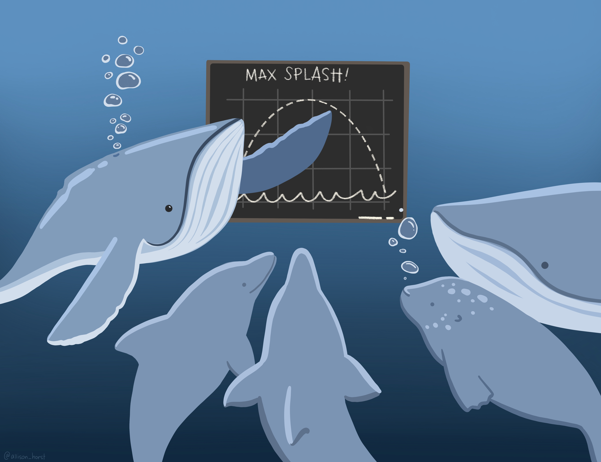

```{r}
#| eval: true
#| echo: false
#| out-width: "80%"
#| fig-align: "center"

```

:::{.gray-text .center-text}
*Artwork by [Allison Horst](https://allisonhorst.com/)*
:::

<!-- ## Pre-class prep -->

<!-- No pre-class prep before our first day of class! -->

## Class materials

|  Session  |  Lecture slides (blank) |   After class slides|  Extra Examples|
|-------------------|-----------------------------------------------------------------------------------------------------------------------------------------------------|-----|-----|
| day 1 / morning   | [Basic algebra review, rules of exponents, units, and unit conversions](slides/day1.1-slides.qmd){target="_blank"} | [Slides](slides/after-class-slides/day1.1-slides-class-2026.pdf){target="_blank"}  | [Examples](examples/day1-morning-extra-examples.qmd){target="_blank"} |
| day 1 / afternoon | [Functions (interpreting & evaluating), reading graphs, lines, exponential function, logarithms](slides/day1.2-slides.qmd){target="_blank"} | [Slides](slides/after-class-slides/day1.2-slides-class-2026.pdf) | [Examples](examples/day1-afternoon-extra-examples.qmd){target="_blank"} |
: {.hover .bordered tbl-colwidths="[15,35,30,20]"}

<!-- ## End-of-day practice

Complete the following tasks / activities before heading home for the day!

- [ **Day 1 Practice:** Problems, gut checks, R Projects, and a function](eod-practice/eod-day1.qmd) -->