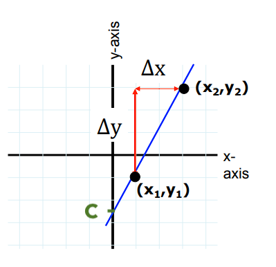

## {#title-slide data-menu-title="Title Slide" background="#053660"} 

[EDS 212: Day 1, Lecture 2]{.custom-title}

[*Functions, graphs, and linear functions*]{.custom-subtitle}

<hr class="hr-teal">

[August 3^rd^, 2026]{.custom-subtitle3}

---

## {#eds212-basics data-menu-title="EDS 212 basics" background-color="#003660"}


<div class="page-center">
<div class="custom-subtitle">Functions</div>
</div>

---

## {#functions data-menu-title="Functions"} 

[Functions]{.slide-title}

<hr>

[Functions are mathematical expressions that tell us how input values are related to output values.]{.body-text-m}

<br>

. . .

For example, $y = 3x-5$ is a function that tells us the **value of y** at **any value of x**. In this scenario, we would probably say **y is a function of x**. 

<br>

. . .

Could you also rewrite it and say **x is a function of y**? 

Here, with no knowledge of what's an input and what's an output, sure - but usually in environmental data science we specify the input variable(s), and the output variable(s) carefully. 

What follows is the expression in the format of: "**[output variable(s)] is/are a function of [input variable(s)]**". 

---

## {#inputs-outputs data-menu-title="Inputs & outputs"} 

[Thinking about inputs and outputs]{.slide-title}

<hr>

<br>

For the following combinations of related variables, which do you expect would be the **input** and the **output** in a function describing how they are related? E.g. "Evapotranspiration is a function of air temperature."

<br>

✏️ [Write your answer individually as **a sentence**.]{style="color:green;"}

::: {.body-text-m}
1. fuel (biomass) / slope / wildfire severity / windspeed / air temperature

2. wind speed / power generated by wind turbine

3. soil C:N ratio / bacterial biomass / soil water content / leaf litter decomposition rate
:::

::: {.notes}
1. wildfire severity is a function of fuel and slope and windspeed and air temperature
2. power generated by wind turbine is a function of wind speed
3. leaf litter decomposition rate is a function of soil C:N ratio and bacterial biomass and soil water content
:::

<!-- --- -->

<!-- ```{r} -->
<!-- #| eval: true -->
<!-- #| echo: false -->
<!-- #| out-width: "100%" -->
<!-- #| fig-align: "center" -->
<!-- knitr::include_graphics("images/betz_limit.png") -->
<!-- ``` -->

<!-- ::: {.center-text .body-text-s .gray-text} -->
<!-- Schaffarczyk A.P. (2020) Types of Wind Turbines. In: Introduction to Wind Turbine Aerodynamics. Green Energy & Technology. Springer, Cham. https://doi-org.proxy.library.ucsb.edu:9443/10.1007/978-3-030-41028-5_2 -->
<!-- ::: -->

---

## {#fxn-notation-blank data-menu-title="Function notation"} 

[Function notation]{.slide-title}

<hr>


---

## {#fxn-notation data-menu-title="Function notation"} 

[Function notation]{.slide-title}

<hr>

<br>

[Single variable (univariate) function:]{.body-text-l} 

$f(x) = [expression\space containing \space x]$

<br>


[Multivariate function:]{.body-text-l} 

$g(a,T,z)=[expression\space containing \space a, T, \space and \space z]$

---

## {#eval-fxns-blank data-menu-title="Evalutating functions"} 

[Evaluating functions]{.slide-title}

<hr>

<br>

::: {.body-text-m}
We evaluate functions by plugging in values of the input variables. 

<br>

✏️ [Example:]{style="color:green;"}

<br>

Evaluate $g(x,t)=2.4x+0.5t^2$ at $x = 3$ and $t = 10$

:::

---

## {#eval-fxns data-menu-title="Evalutating functions"} 

[Evaluating functions]{.slide-title}

<hr>

<br>

::: {.body-text-m}
We evaluate functions by plugging in values of the input variables. 

<br>

✏️ [Example:]{style="color:green;"}

<br>

Evaluate $g(x,t)=2.4x+0.5t^2$ at $x = 3$ and $t = 10$

<br>

$g(3, 10) = 2.4(3) + 0.5(10^2)= 57.2$
:::


---

## {#graphs-title data-menu-title="Graphs title" background-color="#003660"}


<div class="page-center">
<div class="custom-subtitle">Graphs</div>
</div>

---

## {#graphs data-menu-title="Graphs"} 

[Why graphs?]{.slide-title}

<hr>

Graphs are a way for us to more easily process trends or patterns that may be more challenging to understand in a table or list.

:::{.center-text}
**Which looks better and is easier to understand?**
:::

:::: {.columns}
::: {.column width="50%"}
```{r}
library(DT)
library(tidyverse)

car<-mtcars %>% 
  select(mpg,cyl,disp,hp)
DT::datatable(car,
              fillContainer = FALSE, options = list(pageLength = 4))
```

:::

:::{.column width="50%"}
```{r,echo=FALSE, fig.width=6, fig.height=6,out.width="90%",fig.align='right'}
ggplot(mtcars, aes(x=as.factor(cyl), y=mpg)) + 
    geom_boxplot(fill="slateblue", alpha=0.2) + 
    xlab("Number of Cylinders")+
  theme_classic()+
  theme(text = element_text(size = 28)) 
```
:::
::::

---

## {#xy-coordinates data-menu-title="xy coordinates"}

[The $xy$ coordinate system]{.slide-title}

<hr>

::::{.columns}
:::{.column width="50%"}

Graphs generally move in a 2-dimensional plane with a coordinate system using two axes:

- $x$-axis (horizontal axis)

- $y$-axis (vertical axis)


<br>

Axes units must be defined depending on the application.

:::{.incremental}

We use pairs of numbers to place data:

- A point on the $xy$ plane with **coordinates** $(a,b)$ means the point is located at $a$ on the $x$-axis and at $b$ on the $y$-axis.

- Where would (2,-1) go on the graph?

:::
:::
:::{.column width="50%"}

```{r echo=FALSE}
knitr::include_graphics("images/cart.png")
```
:::
::::

---

## {#graph-series data-menu-title="Graphs series of points to make lines"}

[We can join series of points to make graphs]{.slide-title}

<hr>

::::{.columns}
:::{.column width="50%"}
```{r echo=FALSE}
set.seed(1)
x=seq(0,10)
y=x+1.5*rnorm(10)
pdf<-data.frame(x=x,y=y)

DT::datatable(round(pdf,2),
              fillContainer = FALSE, options = list(pageLength = 6))
```

:::
:::{.column width="50%"}

```{r, echo=FALSE,fig.height=5.5,fig.width=5,out.width="90%"}
ggplot(pdf,aes(x=x,y=y))+
  geom_point(size=4)+
  geom_path(linewidth=2)+
  geom_smooth(method="lm",se=FALSE,size=2)+
  annotate("text",x=2.9,y=8,label="Blue Regression Line\ny=0.856x+0.44",size=6)+
  theme_classic()+
  theme(text = element_text(size = 28)) 
```

:::
::::

--- 

## {#graph-fcn data-menu-title="Most functions can be shown on graphs"}

[Functions on a single variable and a single output can be graphed]{.slide-title}

<hr>

::::{.columns}
:::{.column width="50%"}

- $\color{green}{y=sin(3x)+2x}$

<br>

- $\color{red}{y=0.5x^3+x^2-5x}$

<br>

- $\color{blue}{y=0.85x+0.44}$

:::
:::{.column width="50%"}

```{r echo=FALSE}

x=seq(0,10,by=0.01)
sn=sin(3*x)+2*x
pol=-0.2*x^3+2*x^2-2*x
reg=x*0.85+0.44

p2df=data.frame(sin=sn,polynomial=pol,linear=reg,x=x) %>% 
  pivot_longer(cols=!x,values_to="values",names_to = "fun")
```


```{r echo=FALSE, fig.align='center',fig.dim=c(6,8),out.width="70%"}
p1<-ggplot(p2df,aes(x=x,y=values,color=fun))+
  geom_path(linewidth=3)+
  theme_classic()+
  scale_color_manual(values=c("blue","red","darkgreen"),name="Function Type")+
  labs(y="y")+
  theme(text = element_text(size = 28)) +
  geom_hline(yintercept=0,color="black",size=1.5)+
  scale_x_continuous(expand = c(0, 0),limits = c(0,11)) +
  scale_y_continuous(expand = c(0, 0),limits=c(-22,22))+
  theme(legend.position = c(.5,.25))
  
p1
  
```
:::
::::

---

## {#graph-ingredients data-menu-title="Two key ingredients to graphs"}

[Two key ingredients to graphs]{.slide-title}

<hr>

::::{.columns}
:::{.column width="50%"}


Intercepts

- $x$-intercept

  - Where does the graph intersect the $x$-axis? 
  - In other words, for what values of $x$ do we have $(x,0)$ be part of the graph?
    
- $y$-intercept

    - Where does  the graph intersect the $y$-axis? 
    - In other words, for what value of $y$ do we have $(0,y)$ be part of the graph?
    

:::

:::{.column width="50%"}
:::{.center-text}
What are the intercepts of the polynomial function in red?
:::

```{r echo=FALSE,fig.align='center',fig.dim=c(6,8),out.width="70%"}
p1+theme(legend.position = "none")
  
```
:::
::::

---

## {#understanding-graphs data-menu-title="Graphs explanation"} 

[Understanding graphs]{.slide-title}

<hr>

<br>

[When you look at graphs, the first things you should ask:]{.body-text-m}  

<br>

- What variables are being plotted (e.g. x- & y-axis, including units)?

<br>

- What values are plotted (e.g. raw values, transformed, means, etc.)?

<br>

- What are the overall takeaways and am I understanding them responsibly?

---

## {#reading-graphs data-menu-title="Graphs explanation"} 

[Reading graphs (in general)]{.slide-title}

<hr>

>"On the x-axis we have [x-variable] measured in  [units] and on the y-axis the the [y-variable] measured in [units]. This figure shows the [change/pattern/relationship] between [x-variable] and [y-variable]. Overall [overall statement of pattern / trend / findings]."

. . .

{width="60%" fig-align="center"}

---


## {#reading-graphs-3 data-menu-title="Graphs explanation"} 

[Reading graphs (in general)]{.slide-title}

<hr>

>"On the x-axis we have [x-variable] measured in  [units] and on the y-axis the the [y-variable] measured in [units]. This figure shows the [change/pattern/relationship] between [x-variable] and [y-variable]. Overall [overall statement of pattern / trend / findings]."


](/course-materials/slides/images/correlation-1-both.png){width="80%" fig-align="center"}

---

## {#graphs-reading-practice-1 data-menu-title="Graphs explanation"} 

[Reading graphs practice]{.slide-title3}

<hr>
::: {.body-text-s}

💬 [Partner 1 gets to read the graph for the first variable.]{style="color:green;"}

>"On the x-axis we have [x-variable] measured in  [units] and on the y-axis the the [y-variable] measured in [units]. This figure shows the [change/pattern/relationship] between [x-variable] and [y-variable]. Overall [overall statement of pattern / trend / findings]."

:::

. . .

{width="55%" fig-align="center"}

<!-- 
[Possibly with additional context as useful for the audience to put those findings into perspective (e.g. "this reduction represents an 82% decline in rainbowfish stocks along the Narnia Coast since 1991").]{.body-text-m}  -->

---

## {#graphs-reading-practice-2 data-menu-title="Graphs explanation"} 

[Reading graphs practice]{.slide-title3}

<hr>

::: {.body-text-s}

💬 [Partner 2 gets to read the plot for the second variable, provide context for the data, and hypothesise an explanation.]{style="color:green;"}

>"On the x-axis we have [x-variable] measured in  [units] and on the y-axis the the [y-variable] measured in [units]. This figure shows the [change/pattern/relationship] between [x-variable] and [y-variable]. Overall [overall statement of pattern / trend / findings]."

:::

. . .


](/course-materials/slides/images/correlation-2-thomas-vehicle-thefts.png){width="55%" fig-align="center"}

---

## {#graphs-reading-practice-mono-lake data-menu-title="Graphs explanation"} 

[Reading graphs practice]{.slide-title3}

<hr>

```{r}
#| eval: true
#| echo: false
#| out-width: "100%"
#| fig-align: "center"
knitr::include_graphics("images/mono_lake_graph.png")
```

---

## {#break data-menu-title="5 minute break"} 

[Let's take a 5 minute break]{.slide-title}

<hr>


---

## {#lines-title data-menu-title="Lines" background-color="#003660"}


<div class="page-center">
<div class="custom-subtitle">Lines</div>
</div>
---

## {#slope-int-blank data-menu-title="Slope-Intercept Form"}

[Linear functions: slope-intercept form]{.slide-title}

<hr>

<div style="position: absolute; bottom: 550px; right: 1000px; font-size: 1em;">                                                                               
  ✏️                    
</div>  


---

## {#slope-int data-menu-title="Slope-Intercept Form"}

[Linear functions: slope-intercept form]{.slide-title}

<hr>

<br>

Easiest model to describe linear relationship between two variables!

$$
\huge
\begin{align}
\underbrace{y}_{\text{output}}=\overbrace{m}^{\text{Slope}}\underbrace{x}_{\text{input}}+\overbrace{b}^{\text{$y$ intercept}}
\end{align}
$$

---

## {#find-line-eq-blank data-menu-title="Finding the equation of a line"}

[Finding the equation of a line]{.slide-title}

<hr>

<div style="position: absolute; bottom: 550px; right: 1000px; font-size: 1em;">                                                                               
  ✏️                    
</div>  


---

## {#find-line-eq-2 data-menu-title="Finding the equation of a line"}

[Finding the equation of a line]{.slide-title}

<hr>

Given two points $(x_1, y_1)$ and $(x_2, y_2)$ on the line:

::::{.columns}
:::{.column width="50%"}

(1) Find $m$, the **slope**, by using the two points:

$$
m=\frac{\Delta y}{\Delta x}=\frac{y_2-y_1}{x_2-x_1}.
$$

2. Find $c$, the **y-intercept**:

Since $(x_1, y_1)$ is on the line, it satisfies:

$$y_1 = mx_1+ c.$$
We can solve for $c$ to obtain:

$$c = y_1 - mx_1.$$

:::

:::{.column width="50%"}

```{r echo=FALSE,fig.align='center',out.width="80%"}

```

:::
::::

---

## {#line-equation-practice-1 data-menu-title="Equation of a line: practice"}

[Equation of a line: practice]{.slide-title}

<hr>

- Find the equation of the line that:

  (a) passes through $(3,5)$ and $(2,-1)$.

  (b) passes through $(2,-5)$ and has $x$-intercept equal to 4.

  (c) has the following graph:

```{r echo=FALSE,fig.align='center',out.width="80%"}
# Set up plot area

x_min <- -3
x_max <- 3

y_min <- -4
y_max <- 4

x <- seq(x_min, x_max, length.out = 100)
y <- (3/2)*x + 1

plot(x, y, type = "l", lwd = 4, col="green",
     xlim = c(x_min, x_max), ylim = c(y_min, y_max),
     xlab = "x", ylab = "y",
     xaxt = "n", yaxt = "n")

# Add gridlines at integer spacing
abline(h = seq(x_min, x_max, by = 1), col = "lightgray", lty = "dotted")
abline(v = seq(y_min, y_max, by = 1), col = "lightgray", lty = "dotted")

# Add axis lines through origin
abline(h = 0, v = 0, col = "gray50")

# Redraw the line on top of gridlines
lines(x, y, lwd = 2)

# Add tick marks (integer spacing)
axis(1, at = seq(x_min, x_max, by = 1))
axis(2, at = seq(y_min, y_max, by = 1))
```

- Make a graph showing the line that passes through (3,-1) and has slope equal to 2. 


---

## {#line-equation-practice-sol-1 data-menu-title="Equation of a line: practice"}

[Equation of a line: practice]{.slide-title}

<hr>

Find the equation of the line that passes through $(3,5)$ and $(2,-1)$.

✏️ [Let's see a solution.]{style="color:green;"}

---

## {#line-equation-practice-sol-2 data-menu-title="Equation of a line: practice"}

[Equation of a line: practice]{.slide-title}

<hr>

Find the equation of the line that passes through $(2,-5)$ and has $x$-intercept equal to 4.

✏️ [Let's see a solution.]{style="color:green;"}

---

## {#line-equation-practice-3 data-menu-title="Equation of a line: practice"}

[Equation of a line: practice]{.slide-title}

<hr>

Find the equation of the line that has the following graph:

:::: {.columns}

::: {.column width="60%"}

```{r echo=FALSE,fig.align='center',out.width="100%"}
# Set up plot area

x_min <- -3
x_max <- 3

y_min <- -4
y_max <- 4

x <- seq(x_min, x_max, length.out = 100)
y <- (3/2)*x + 1

plot(x, y, type = "l", lwd = 4, col="green",
     xlim = c(x_min, x_max), ylim = c(y_min, y_max),
     xlab = "x", ylab = "y",
     xaxt = "n", yaxt = "n")

# Add gridlines at integer spacing
abline(h = seq(x_min, x_max, by = 1), col = "lightgray", lty = "dotted")
abline(v = seq(y_min, y_max, by = 1), col = "lightgray", lty = "dotted")

# Add axis lines through origin
abline(h = 0, v = 0, col = "gray50")

# Redraw the line on top of gridlines
lines(x, y, lwd = 2)

# Add tick marks (integer spacing)
axis(1, at = seq(x_min, x_max, by = 1))
axis(2, at = seq(y_min, y_max, by = 1))
```
:::


::: {.column width="40%"}

:::

:::

✏️ [Let's see a solution.]{style="color:green;"}

---

## {#line-equation-practice-4 data-menu-title="Equation of a line: practice"}

[Equation of a line: practice]{.slide-title}

<hr>

Make a graph showing the line that passes through (3,-1) and has slope equal to 2. 

✏️ [Let's see a solution.]{style="color:green;"}

---

## {#interpreting-slope data-menu-title="Interpreting the slope title" background-color="#003660"}


<div class="page-center">
<div class="custom-subtitle">Interpreting the slope</div>
</div>

---

## {#avg-rate-of-change data-menu-title="Slope (average)"} 

[Slope (average)]{.slide-title}

<hr>

::: {.body-text-m}
Sometimes, it can be useful to find the **average rate of change** of a function. 

Between any two points $(x_1,y_1)$ and $(x_2,y_2)$  on the graph of a function, the slope is found by:

<br>

$$m=\frac{\Delta y}{\Delta x}=\frac{y_2-y_1}{x_2-x_1}$$

Same idea as in a line!
:::

---

## {#slope-roc data-menu-title="Slope represents rate of change"}

[Slope represents rate of change]{.slide-title}

<hr>

Ice-core data before 1958. Mauna Loa data after 1958. 

](images/loa.PNG)

---

## {#practice-out-loud data-menu-title="Practice out loud"} 

[Get into the practice of saying the meaning out loud]{.slide-title3}

<hr>

- As if you're explaining it to someone unfamiliar with the data
- Including units
- Without overstating certainty 

[**For example:**]{.body-text-m} 

>"Between 1972 and 2020 the price of hobbit homes increased by an average of $2,450 per year" 

<br>

*differs from*

<br>

>"Between 1972 and 2020 the price of hobbit homes increased by $2,450 per year." 

---

## {#whole-story data-menu-title="Whole story"} 

[The *average* slope of a continuous function rarely tells the whole story]{.slide-title3}

<hr>

```{r}
#| eval: true
#| echo: false
#| out-width: "100%"
#| fig-align: "center"
knitr::include_graphics("images/cod_graph.jpg")
```


---

## {#slope-avg cdata-menu-title="can be average or instantaneous"}

[Slope can be *average* or *instantaneous*]{.slide-title}

<hr>

::::{.columns}
:::{.column width="50%"}


- Rise over run can always be used to find average rate of change between two parts of a graph


:::

:::{.column width="50%"}

- Instantaneous rate of change leads us to ✨calculus✨.

:::
::::

```{r echo=FALSE,fig.align='center',out.width="50%"}
knitr::include_graphics("images/trex.PNG")
```
