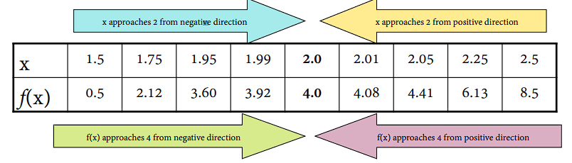
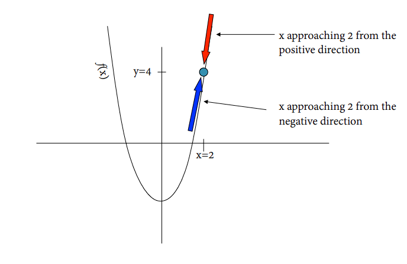
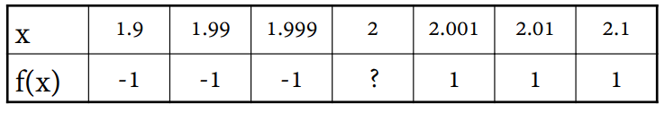
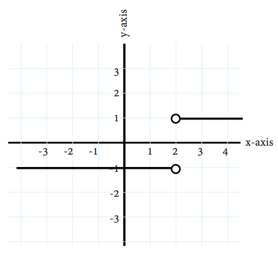

## {#title-slide data-menu-title="Title Slide" background="#053660"} 

[EDS 212: Day 2, Lecture 1]{.custom-title}

[*Limits and derivatives*]{.custom-subtitle}

<hr class="hr-teal">

[August 4^th^, 2025]{.custom-subtitle3}

---

## {#overview data-menu-title="Overview"} 

[Overview of Day 2 topics]{.slide-title}

<hr>

<br>

- [Limits]{.body-text-m} 
- [Derivatives]{.body-text-m} 

---

## {#limits-title data-menu-title="Logarithms" background-color="#003660"}


<div class="page-center">
<div class="custom-subtitle">Limits</div>
</div>

---

## {#limits data-menu-title="Limits"}

[Limits]{.slide-title}

<hr>

**Definition**

We say a number $L$ is the limit of a function $f(x)$ as its variable $x$ approaches a number $c$, if the function's output values $f(x)$ approach $L$ when $x$ get closer to $c$. 

<br>

We write this symbolically as:

$$
\large
\lim_{x\to c} f(x)=L
$$

<br>

We read this as: ["The limit of $f(x)$ as $x$ approaches $c$ is $L$."]{.teal-text}

---

## {#lim-ex data-menu-title="Limit Example"}

[Limits example: numerical]{.slide-title}

<hr>

What is the limit of $f(x)=2x^2-4$ as $x$ approaches 2?

We need to examine the values of $f(x)$ as $x$ gets closer to 2 from both sides.

<br>

. . . 

{fig-align="center" width="70%"}

<!-- ```{r fig.align='center',out.width="90%"}

``` -->

. . .

From both directions it looks like $f(x)$ converges to 4.

So, we say that ["The limit of $2x^2-4$ as $x$ approaches 2 is 4"]{.teal-text}. We can write it like this:

$$
\lim_{x\to 2}(2x^2-4)=4
$$


---

## {#limit-graph-sol data-menu-title="Graphical Solution"}

[Limits example: graph]{.slide-title}

<hr>

What is the limit of $f(x)=2x^2-4$ as $x$ approaches 2?

```{r fig.align='center',out.width="200%"}

```

From both directions it looks like $f(x)$ converges to 4.

So, $\lim_{x\to 2}(2x^2-4)=4$.

---

## {#lim-discon data-menu-title="What happens with discontinuous functions"}

[Do limits always exist?]{.slide-title}

<hr>

The function $|x|$ is the **absolute value function**. It is such that

$$
|x| = 
\begin{cases}
x, & \text{ if } x\geq 0 \\
-x, & \text{ if } x <0
\end{cases}
.
$$

. . .

<br>

✏️ [What happens to $f(x)$ at $x=2$?]{style="color:green;"}


✏️ [Try calculating:]{style="color:green;"}
[
$$
\lim_{x\to 2}\frac{|x-2|}{x-2}.
$$
]{style="color:green;"}

<br>

Hint: Try to do numerical approximations or draw the graph of this function. 

---

## {#mean-girls data-menu-title="Mean girls"}

[Do limits always exist?]{.slide-title}

<hr>

✏️ [What happens to $f(x)$ at $x=2$?]{style="color:green;"}

This function is not defined at $x=2$ since it would require us to divide by zero, which is undefined.

. . . 

<br>

[Try calculating $\lim_{x\to 2}\frac{|x-2|}{x-2}$.]{style="color:green;"}

Let's investigate:

```{r fig.align='center',out.width="60%"}

```

---

## {#graph data-menu-title="Clearer on the graph"}

[Do limits always exist?]{.slide-title}

<hr>

The function $\frac{|x-2|}{x-2}$ approaches different values from either side at $x=2$.

<div style="display:flex; justify-content:center;">
  
</div>

Therefore... [the limit does not exist!]{.teal-text}

---

## {#lunch-break data-menu-title="Lunch break"} 

[Lunch break!]{.slide-title}

<hr>


