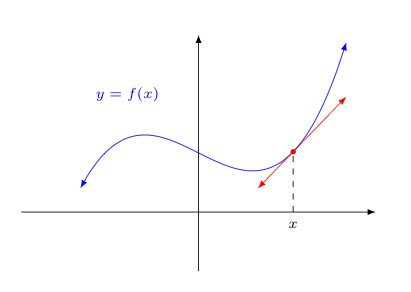
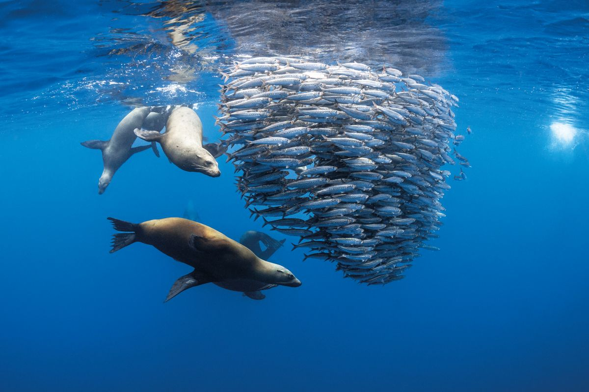
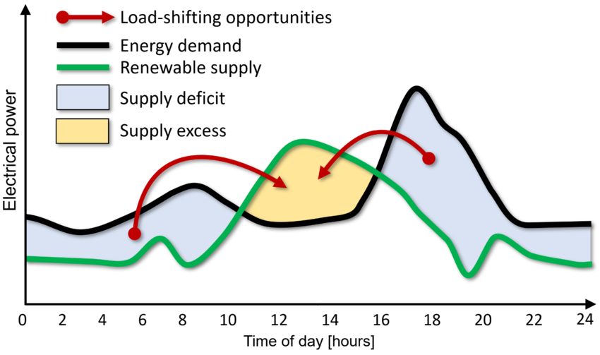
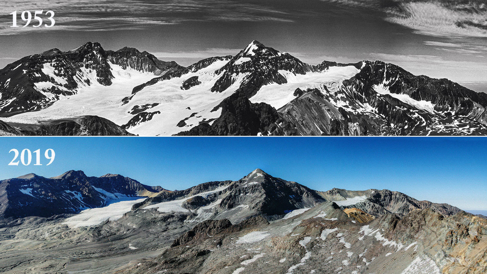
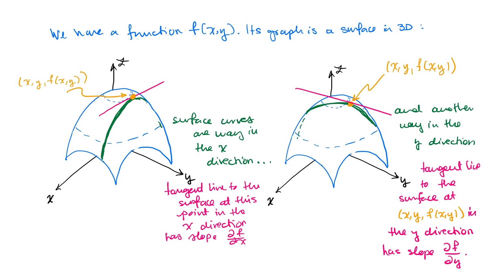

## {#title-slide data-menu-title="Title Slide" background="#053660"} 

[EDS 212: Day 2, Lecture 2]{.custom-title}

[*Derivatives*]{.custom-subtitle}

<hr class="hr-teal">

[August 4^th^, 2025]{.custom-subtitle3}

---

## {#intro-derv data-menu-title="Introduction to Derivates" background-color="#003660"}

<div class="page-center">
<div class="custom-subtitle">Introduction to Derivatives</div>
</div>

<!---------------------------------------------------------->

## {#alltogether data-menu-title="Putting it all together"}

[Recall average and instantaneous rate of change]{.slide-title}

<hr>


```{r echo=FALSE,fig.align='center',out.width="50%"}
knitr::include_graphics("images/trex.PNG")
```

**Big idea:** Taking the average rate of change to a set limit will eventually converge to the instantaneous. 

## {#average-slope data-menu-title="Average slope"}

[Average slope]{.slide-title}

<hr>

<div style="position: absolute; bottom: 550px; right: 1000px; font-size: 1em;">                                                                               
  ✏️                    
</div>  

```{r, fig.align='center'}

library(tidyverse)

x=seq(-1,3,by=0.01)
y=x^2

lim_df<-data.frame(x=x,y=y)

dx=2
y2=y[which(lim_df$x==dx)]

slope=y2/dx
line=x*slope


ggplot(data=lim_df,aes(x=x,y=y))+
  geom_line(color="black", linewidth=3)+
  theme_classic()+
  annotate("point",x=0,y=0,size=6,color="blue")+
  theme(text = element_text(size = 28),
        axis.title.x = element_blank(),
        axis.title.y = element_blank()) + 
  coord_fixed(ratio = 1) +
  coord_cartesian(xlim=c(-1,3), ylim=c(0,8))
```

Start with:


<br>

Nearby point:

<br>

Average slope:

---

## {#average-slope-filled data-menu-title="Average slope"}

[Average slope]{.slide-title}

<hr>

```{r, fig.align='center'}
x=seq(-1,3,by=0.01)
y=x^2

lim_df<-data.frame(x=x,y=y)

dx=2
y2=y[which(lim_df$x==dx)]

slope=y2/dx
line=x*slope


p0<-ggplot(data=lim_df,aes(x=x,y=y))+
  geom_line(color="black",linewidth=3)+
  theme_classic()+
  geom_line( data = data.frame(x = seq(-1, 3, by = 0.01),  
                               y = 1.5 * seq(-1, 3, by = 0.01)),
            aes(x = x, y = y),
            color="red",
            linewidth=2)+
  annotate("point",x=0,y=0,size=8,color="blue")+
  annotate("text", 
            x=0, y=1, 
            label="(x, f(x))",
            size=10,
            color="blue")+
  annotate("point",x=1.5, y=2.25, size=8, color="blue")+
  annotate("text", 
            x=2.25, y=2.25, 
            label="(x+Δx, f(x+Δx))",
            size=10,
            color="blue") +
  theme(text = element_text(size = 28),
        axis.title.x = element_blank(),
        axis.title.y = element_blank()) + 
  coord_fixed(ratio = 1) +
  coord_cartesian(xlim=c(-1,3), ylim=c(0,8))

p0
```

Start with a point $(x,f(x))$ on the graph. 

A nearby point can be $(x+\Delta x, f(x+\Delta x))$, where $\Delta x$ is a short distance from $x$. 


<br>

The average slope between $(x,f(x))$ and $(x+\Delta x, f(x+\Delta x))$ is given by

<span style="color:red">
$$\text{average slope} = \frac{f(x+\Delta x) - f(x)}{(x+\Delta x)-x} = \frac{f(x+\Delta x) - f(x)}{\Delta x}.$$
</span>

**What happens when $\Delta x$ becomes smaller and smaller?**

---

## {#walkthrough-1 data-menu-title="Walkthrough"}

[What happens when $\Delta x \to 0$?]{.slide-title}

<hr>

```{r, fig.align='center'}

library(tidyverse)

x=seq(-1,3,by=0.01)
y=x^2

lim_df<-data.frame(x=x,y=y)

dx=2
y2=y[which(lim_df$x==dx)]

slope=y2/dx
line=x*slope


p0<- ggplot(data=lim_df,aes(x=x,y=y))+
  geom_line(color="black", linewidth=3)+
  theme_classic()+
  annotate("point",x=0,y=0,size=6,color="blue")+
  theme(text = element_text(size = 28),
        axis.title.x = element_blank(),
        axis.title.y = element_blank()) + 
  coord_fixed(ratio = 1) +
  coord_cartesian(xlim=c(-1,3), ylim=c(0,8))

p1<-p0+
  geom_point(aes(x=dx,y=y2),color="blue",size=6)+
  geom_line(aes(x=x,y=line),color="red",linewidth=2)+
  annotate("text",x=1,y=7,label="Delta~x==2",parse=TRUE,size=14)+
  annotate("text",x=1,y=4.5,label="Slope=2",size=14)
p1

```

---

## {#walkthrough-2 data-menu-title="Walkthrough"}

[What happens when $\Delta x \to 0$?]{.slide-title}

<hr>

```{r, fig.align='center'}
dx=1
y2=y[which(lim_df$x==dx)]

slope=y2/dx
line=x*slope
p2<-p0+
  geom_line(aes(x=x,y=line),color="red",linewidth=2)+
  geom_point(aes(x=dx,y=y2),color="blue",size=6)+
  annotate("text",x=1,y=7,label="Delta~x==1",parse=TRUE,size=14)+
  annotate("text",x=1,y=4.5,label="Slope=1",size=14)

p2
```

---

## {#walkthrough-3 data-menu-title="Walkthrough"}

[What happens when $\Delta x \to 0$?]{.slide-title}

<hr>

```{r, fig.align='center'}
dx=0.5
y2=y[which(lim_df$x==dx)]

slope=y2/dx
line=x*slope
p3<-p0+
  geom_line(aes(x=x,y=line),color="red",linewidth=2)+
  geom_point(aes(x=dx,y=y2),color="blue",size=6)+
  annotate("text",x=1,y=7,label="Delta~x==0.5",parse=TRUE,size=14)+
  annotate("text",x=1,y=4.5,label="Slope=0.5",size=14)
p3
```

---

## {#walkthrough-4 data-menu-title="Walkthrough"}

[What happens when $\Delta x \to 0$?]{.slide-title}

<hr>

```{r, fig.align='center'}
dx=0.25
y2=y[which(lim_df$x==dx)]

slope=y2/dx
line=x*slope
p4<-p0+
  geom_line(aes(x=x,y=line),color="red",linewidth=2)+
  geom_point(aes(x=dx,y=y2),color="blue",size=6)+
  annotate("text",x=1,y=7,label="Delta~x==0.25",parse=TRUE,size=14)+
  annotate("text",x=1,y=4.5,label="Slope=0.25",size=14)
p4
```

---

## {#tangent data-menu-title="Tangent Lines"}

[Tangent lines]{.slide-title}

<hr>

**What if we let $\Delta x=0$?**

Then we would have a slope line that only touches the graph at exactly $x$.
<!--
```{r,fig.align='center'}

```
-->

```{r, fig.align='center'}

slope=0
line=x*slope
p5<-p0+
  geom_line(aes(x=x,y=line),color="red",linewidth=2)+
  annotate("text",x=1,y=7,label="Delta~x==0",parse=TRUE,size=14)+
  annotate("text",x=1,y=4.5,label="Slope=?",size=14)
p5
```

:::{.center-text .teal-text}
These very special types of lines are called **tangent lines**.
:::

---

## {#recap data-menu-title="Recap in math notation"}

[Derivative definition]{.slide-title}

<hr>

Remember the slope of the line that passes between two points $(x_1, y_1)$ and $(x_2, y_2)$ is:

$$\text{slope}=\frac{y_2-y_1}{x_2-x_1}.$$

. . .

If we have a function $f(x)$, then $(x,f(x))$ represents a point on its graph.

. . .

Choose a different point on the graph that is $\Delta x$ away: $(x+\Delta x,f(x+\Delta x))$.

. . .

Plug these pointson the graph of $f(x)$ into the slope equation:

$$
\text{slope}=\frac{f(x+\Delta x)-f(x)}{\Delta x}.
$$

. . .

When we let $\Delta x \to 0$ we get <span style="color:red">**the slope of the tangent line at $x$**</span>

<span style="color:red">
$$
\large
f'(x)=\lim_{\Delta x \to 0} \frac{f(x+\Delta x)-f(x)}{\Delta x}
$$
</span>

<span style="color:red">**This is the derivative of $f$ at $x$.**</span>
Also denoted $\frac{df}{dx}$. 

<!--
<br>

:::{.center-text}
*Most common notation*
:::

$$
\large
f'(x)\text{, or }\frac{dy}{dx}
$$

-->

---

## {#deriv9 data-menu-title="Derivative"} 

```{r}
#| eval: true
#| echo: false
#| out-width: "100%"
#| fig-align: "center"
knitr::include_graphics("images/derivative_9.jpg")
```

::: {.footer}
*Artwork by [Allison Horst](https://allisonhorst.com/)*
:::

---

## {#diff-func data-menu-title="Not all functions are differentiable"}

[Not all functions are differentiable]{.slide-title}

<hr>

- All differentiable functions are continuous, but not all continuous functions are differentiable.

. . .

- The absolute value function $|x|$ is one example, this is defined by 
$$|x| = 
\begin{cases}
  x  &, x \geq 0\\
  -x &, x<0
\end{cases}.$$

It's graph is:

```{r, fig.align='center',out.width="40%"}
x=seq(-5,5)
y=abs(x)

df<-data.frame(x=x,y=y)

df %>% 
  ggplot(aes(x=x,y=y))+
  geom_vline(xintercept = 0)+
  geom_line(linewidth=3,color="red")+
  theme_classic()+
  theme(panel.border = element_blank(), axis.line.y = element_blank())+  
  scale_x_continuous(expand = c(0, 0))+
  scale_y_continuous(expand = c(0, 0))+
  theme(text = element_text(size = 28)) 
```

---

## {#break data-menu-title="5 minute break"} 

[Let's take a 5 minute break]{.slide-title}

<hr>


---

## {#applications data-menu-title="Applications"} 

[Why derivatives in an EDS program?]{.slide-title}

<hr>


<br>
<br>
<br>
<br>
<br>

::: {.center-text .body-text-l}
Describing rates of change is common in environmental science (rate of pollutant concentration change, rate of population growth, rate of energy consumption)
:::

---

## {#calc data-menu-title="Calculus and Derivatives are the study of change"}

[Calculus and derivatives are used to study change]{.slide-title}

<hr>

```{r, fig.align='center',out.width="75%"}
knitr::include_graphics("images/trex-no-labels.PNG")
```

---

## {#envs-change data-menu-title="Enviromental Science is the Study of Change"}

[Environmental Science studies change]{.slide-title}

<hr>

```{r, fig.align='center',out.width="75%"}

```

---

## {#envs-change2 data-menu-title="Enviromental Science is the Study of Change"}

[Environmental Science studies change]{.slide-title}

<hr>

```{r, fig.align='center',out.width="75%"}

```

---

## {#envs-change3 data-menu-title="Enviromental Science is the Study of Change"}

[Environmental Science studies change]{.slide-title}

<hr>

```{r, fig.align='center',out.width="75%"}

```

<br>

[🤔 Talk with a partner, what are 2 fields of environmental science where studying the rate of change and derivatives would be important?]{style="color:green;"}

---

## {#diff-rules-1-blank data-menu-title="Rules for Differentiation (1)"}

[Rules for differentiation (1)]{.slide-title}

<hr>

**Constant Rule** ✏️


<br>
<br>
<br>
<br>
<br>
<br>


**Power Rule** ✏️

---

## {#diff-rules-1 data-menu-title="Rules for Differentiation (1)"}

[Rules for differentiation (1)]{.slide-title}

<hr>

**Constant Rule**

Let $c$ be a constant (so, a number). If $f(x) = c$, then $f'(x)=0$. Equivalently

$$\frac{d}{dx}c = 0$$


**Power Rule**

Let $n$ be a (real) number, if $f(x)= x^n$, then $f'(x) = nx^{n-1}$. Equivalently
$$
\frac{d}{dx}[x^n]
=nx^{n-1}.
$$

. . .

**Examples**   ✏️

$$
\begin{align}
&y=100 & &f(x)=x^5 & &f(x)=\frac{1}{x^2}
\end{align}
$$

---

## {#diff-rules-2-blank data-menu-title="Rules for Differentiation (2)"}

[Rules for differentiation (2)]{.slide-title}

<hr>

**Sum and Difference Rules**

✏️

---

## {#diff-rules-2 data-menu-title="Rules for Differentiation (2)"}

[Rules for differentiation (2)]{.slide-title}

<hr>

**Sum and Difference Rules**

Let $f(x)$ and $g(x)$ be differentiable functions. Then 
$$
\begin{align}
\frac{d}{dx}[f(x)+g(x)]=\frac{d}{dx}f(x)+\frac{d}{dx}g(x) \\
\frac{d}{dx}[f(x)-g(x)]=\frac{d}{dx}f(x)-\frac{d}{dx}g(x)
\end{align}
$$

😵*All this says is: if the function has pieces that are added or subtracted you can take the derivative of each individual piece and add those derivatives.*

. . . 

**Example** ✏️

$$
f(x)=x^3-x^2-15
$$

---

## {#diff-rules-3-blank data-menu-title="Rules for Differentiation (3)"}

[Rules for differentiation (3)]{.slide-title}

<hr>

**Constant Multiplier Rule**

✏️

---

## {#diff-rules-3 data-menu-title="Rules for Differentiation (3)"}

[Rules for differentiation (3)]{.slide-title}

<hr>

**Constant Multiplier Rule**

The derivative of a constant $c$ multiplied by a function $f(x)$ is the same as the constant multiplied by the derivative:

$$\frac{d}{dx}[kf(x)] = k\frac{d}{dx}f(x)$$

. . . 

**Example** ✏️

$$
y=x^2+\sqrt{2}x-\frac{8}{x}+4
$$

---

## {#logs-exp data-menu-title="Derivative of logs & exp"} 

[Derivative of logs & exponents]{.slide-title}

<hr>

<br>

[Two special derivatives:]{.body-text-l}

<br>

- [$\frac{d}{dx}(e^x) = e^x$]{.body-text-l}

<br>

- [$\frac{d}{dx}ln(x)=\frac{1}{x}$]{.body-text-l}

---

## {#diff-rules-summary data-menu-title="Summary of differentiation rules"}

[Summary of differentiation rules]{.slide-title}

<hr>

<br>

| Differentiation Rule | $f'(x)$ notation | $\frac{d}{dx}$ notation |
|----------------------|------------------|-------------------------|
| **Constant Rule** | $f(x)=c \Rightarrow f'(x)=0$ | $\frac{d}{dx}[c]=0$ |
| **Power Rule** | $f(x)=x^n \Rightarrow f'(x)=n x^{n-1}$ | $\frac{d}{dx}[x^n]=n x^{n-1}$ |
| **Sum Rule** | $(g(x)+h(x))'=g'(x)+h'(x)$ | $\frac{d}{dx}[g(x)+h(x)]=\frac{d}{dx}g(x)+\frac{d}{dx}h(x)$ |
| **Difference Rule** | $(g(x)-h(x))' = g'(x)-h'(x)$ | $\frac{d}{dx}[g(x)-h(x)]=\frac{d}{dx}g(x)-\frac{d}{dx}h(x)$ |
| **Constant Multiplier Rule**  | $(c\cdot g(x))'=c\,g'(x)$ | $\frac{d}{dx}[c\,g(x)]=c\,\frac{d}{dx}g(x)$ |

<br>

And two special derivatives: $\frac{d}{dx}(e^x) = e^x$ and $\frac{d}{dx}ln(x)=\frac{1}{x}$.

<br>
<br>

:::{.center-text .body-text-s}
There's more differentiation rules (product, quotient, chain rule). 

They're fun, but we won't be reviewing them.
:::

---

## {#higher-order-der data-menu-title="Higher Order Derivatives"}

[Higher order derivatives]{.slide-title}

<hr>

- We can continue to take derivatives of derivatives.

- The second derivative becomes the rate of change of the rate of change. 

- If we interpret the first derivative as velocity, then the second derivative is acceleration. 

. . .

- Notation: 

    - Function: $f(x) = y$
    - 1st derivative: $f'(x)$ or $\frac{dy}{dx}$
    - 2nd derivative: $f''(x)$ or $\frac{d^2y}{dx^2}$
    - nth derivative: $f^{(n)}(x)$ or $\frac{d^ny}{dx^n}$

---

## {#derivatives-practice data-menu-title="Derivatives practice"}

[Derivatives practice]{.slide-title}

<hr>

[Solve individually and then check with a partner.]{style="color:green;"}

1) Which rules should you use to take these derivatives?

$$
\begin{align}
\text{A)  }& f(x)=3x^4 &\text{B) }  y=4x^2+3x-16
\end{align}
$$

2) Find the derivatives of these functions

$$
\begin{align}
&\text{A) } y=3x^2 & &\text{B) }h(x)=2x(x^2 + 3x) & &\text{C) }g(y)=2\sqrt{y} - e^y + 20\ln(y)
\end{align}
$$

3) Find the 3rd derivative of:

$$G(z)=3z^4-8z^3+2z-19$$

---

## {#derivatives-practice-solve-1 data-menu-title="Derivatives practice"}

[Derivatives practice]{.slide-title}

<hr>

[ ✏️  Let's see a solution!]{style="color:green;"} 

2.B) Find the derivative $$h(x)=2x(x^2 + 3x)$$

---

## {#derivatives-practice-solve-2 data-menu-title="Derivatives practice"}

[Derivatives practice]{.slide-title}

<hr>

[ ✏️  Let's see a solution!]{style="color:green;"} 

2.C) Find the derivative $$g(y)=2\sqrt{y} - e^y + 20\ln(y)$$

---

## {#derivatives-practice-solve-3 data-menu-title="Derivatives practice"}

[Derivatives practice]{.slide-title}

<hr>

[ ✏️  Let's see a solution!]{style="color:green;"}

3) Find the 3rd derivative of $G(z)=3z^4-8z^3+2z-19$.

---

## {#partial-derivatives-title data-menu-title="Introduction to Derivates" background-color="#003660"}

<div class="page-center">
<div class="custom-subtitle">Partial derivatives</div>
</div>

---

## {#partial-derivatives data-menu-title="Partial derivatives"} 

[Partial derivatives]{.slide-title}

<hr>

<br>

[When we find a partial derivative, we find an expression for the slope with respect to *one variable* in a multivariate function.]{.body-text-m}

<br>

[**Notation:** the partials of $f(x,y,z)$ are $\frac{\partial f}{\partial x}$, $\frac{\partial f}{\partial y}$, and $\frac{\partial f}{\partial z}$]{.body-text-m} 

We read $\frac{\partial f}{\partial x}$ as "the partial derivative of $f$ with respect to $x$"

<br>

[**How to take partial derivatives?** Find the derivative with respect to a single variable, *treating all others as constants.*]{.body-text-m} 

---

## {#partial-derivatives-example-1 data-menu-title="Partial derivatives Ex"} 

[Partial derivatives example]{.slide-title}

<hr>

[ ✏️ Find all partial derivatives of]{.body-text-l}


[$$B(x,y, z)=0.4x^3y-3.6y^2+4zx + 8$$]{.body-text-m}

---

## {#partial-derivatives-example-2 data-menu-title="Partial derivatives Ex"} 

[Partial derivatives example]{.slide-title}

<hr>

[Find all partial derivatives of]{.body-text-l}

[$$B(x,y, z)=0.4x^3y-3.6y^2+4zx + 8$$]{.body-text-m}
[$$\frac{\partial B}{\partial x}=1.2x^2y+4z$$]{.body-text-m}
[$$\frac{\partial B}{\partial y}=0.4x^3-7.2y$$]{.body-text-m}
[$$\frac{\partial B}{\partial z}=4x$$]{.body-text-m}

---

## {#partial-derivatives-example-3 data-menu-title="Partial derivatives Ex"} 

[Partial derivatives example]{.slide-title}

<hr>

[Find all partial derivatives of]{.body-text-l}

[$$B(x,y, z)=0.4x^3y-3.6y^2+4zx + 8$$]{.body-text-m}
[$$\frac{\partial B}{\partial x}=1.2x^2y+4z$$]{.body-text-m}
[$$\frac{\partial B}{\partial y}=0.4x^3-7.2y$$]{.body-text-m}
[$$\frac{\partial B}{\partial z}=4x$$]{.body-text-m}


✏️[ What is the value of the partial derivative of $B$ with respect to $z$ at the point $(1,2,3)$?]{style="color:green;"}

---

## {#partial-derivatives-meaning data-menu-title="Partial derivatives meaning"} 

[OK, but what do partials actually mean?]{.slide-title}

<hr>

[The slope with respect to one variable if other variables are held constant.]{.body-text-m} 

{fig-align="center"}

::: {.notes}
- moving up and down
- moving acorss a plane
- twisting / sprialing

consider the above when calcualting speed in each / any direction
:::

---

## {#partial-derivatives-practice data-menu-title="Try one"} 

[Partial derivatives practice]{.slide-title}

<hr>

(A) The temperature (in Celsius) across a surface (where $x$ and $y$ are in meters) is described by:

$$T(x,y)=x^2y-2x+y-1$$

At what "rate" is temperature changing (with respect to distance):


- In the $x$ direction, at the point (1,3) on the surface?
- In the $y$ direction, at the point (0,2) on the surface?

. . .

(B) A dragon's breath temperature ($T$, in degrees Celsius) is modeled as a function of its wingspan ($W$, in meters) and length ($L$, also in meters): 

<br>

$$T(W,L)=0.41WL+2.6W^2$$

- At what rate is breath temperature changing with respect to length for a dragon that is 4.1m long, with a wingspan of 4.5m?

- At what rate is breath temperature changing with respect to wingspan, for the same dragon?

::: {.notes}
-  $\frac{\partial T}{\partial L} = 0.41W$ = 0.41(4.5) = **1.845 degrees C per meter (length)**
- $\frac{\partial T}{\partial W} = 0.41L + 5.2W$ = 0.41(4.1) + 5.2(4.5) = **25.081 degrees C per meter (wingspan)**
:::

---

## {#partial-derivatives-solution-1 data-menu-title="Try one"} 

[Partial derivatives practice]{.slide-title}

<hr>

[✏️ Let's see a solution.]{style="color:green;"}


:::: {.columns}

::: {.column width="50%"}
(A) The temperature (in Celsius) across a surface (where $x$ and $y$ are in meters) is described by:

$$T(x,y)=x^2y-2x+y-1$$

At what "rate" is temperature changing (with respect to distance):


- In the $x$ direction, at the point (1,3) on the surface?
- In the $y$ direction, at the point (0,2) on the surface?

:::


::: {.column width="50%"}

:::

:::

::: {.notes}
- $\frac{\partial T}{\partial x} = 2xy - 2 + 0 + 0$

@(1,3): $2(1)(3) - 2 = 6 -2 = 4$

- $\frac{\partial T}{\partial x} = x^2 + 1$

@(0,2): $0^2+1 = 1$
:::

---

## {#partial-derivatives-solution-2 data-menu-title="Try one"} 

[Partial derivatives practice]{.slide-title}

<hr>

[✏️ Let's see a solution.]{style="color:green;"}

:::: {.columns}

::: {.column width="50%"}
(B) A dragon's breath temperature ($T$, in degrees Celsius) is modeled as a function of its wingspan ($W$, in meters) and length ($L$, also in meters): 

<br>

$$T(W,L)=0.41WL+2.6W^2$$

- At what rate is breath temperature changing with respect to length for a dragon that is 4.1m long, with a wingspan of 4.5m?

- At what rate is breath temperature changing with respect to wingspan, for the same dragon?
:::


::: {.column width="50%"}

:::


:::

---

## {#env-data-example data-menu-title="Environmental data example"} 

[Example: higher order & partial derivatives in environmental data science]{.slide-title2}

<hr>

<br>

[The [**Advection-Dispersion-Reaction Equation**](https://www.enviro.wiki/index.php?title=Advection-Dispersion-Reaction_Equation_for_Solute_Transport) for solute transport models the change in a solute concentration $C$ over time $t$ and $x,y,z$ space, where groundwater is flowing in direction $x$:]{.body-text-m}

<br>

[$$\frac{\partial C}{\partial t}=D_x \frac{\partial^2C}{\partial x^2} + D_y\frac{\partial^2C}{\partial y^2}+D_z\frac{\partial^2C}{\partial z^2}-v\frac{\partial C}{\partial x}-\lambda RC$$]{.body-text-m}

$D_x, D_y, D_z$ are hydrodynamic diffusion coefficients in the $x$, $y$, and $z$ direction.

---

## {#break-it-down data-menu-title="Break it down"} 

[Let's break it down.]{.slide-title}

<hr>

<br>

[$$\frac{\partial C}{\partial t}=D_x \frac{\partial^2C}{\partial x^2} + D_y\frac{\partial^2C}{\partial y^2}+D_z\frac{\partial^2C}{\partial z^2}-v\frac{\partial C}{\partial x}-\lambda RC$$]{.body-text-m}

<br>

- **Left-hand-side:** Rate of concentration change (over time)
- **Right-hand-side first 3 terms:** Concentration change due to dispersion in $x$, $y$, and $z$ directions
- **Right-hand-side fourth term:** Concentration change due to groundwater transport (in groundwater flow direction, x)
- **Right-hand-side final term:** Reaction term (e.g. biodegradation / abiotic degradation)

::: {.notes}
This example is here (probably) to show that partial derivatives are useful in solving real-world environmental problems.
:::
