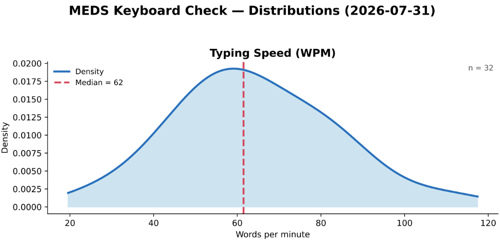
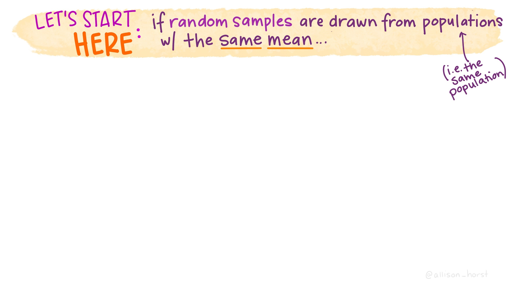

## {#title-slide data-menu-title="Title Slide" background="#053660"} 

[EDS 212: Day 4, Lecture 2]{.custom-title}

[*Basic probability theory, PDFs and PMFs, hypothesis testing intuition*]{.custom-subtitle}

<hr class="hr-teal">

[August 6^th^, 2025]{.custom-subtitle3}

---

## {#probability-title data-menu-title="Basic Probability" background-color="#003660"}

<div class="page-center">
<div class="custom-subtitle">Basic probability concepts</div>
</div>

---

## {#refresh-prob data-menu-title="Refesh"} 

[Why refresh probability?]{.slide-title}

<hr>

::: {.body-text-l}
- Being familiar with the terms
- Hypothesis testing
- Bayesian statistics
- Decision making
:::

---

## {#terminology-blank data-menu-title="Terminology"} 

[Event space, event, and probability]{.slide-title}

<hr>

✏️

---

## {#terminology data-menu-title="Terminology"} 

[Event space, event, and probability]{.slide-title}

<hr>

<br>

::: {.body-text-m}
**Event space:** The collection of all possible unique outcomes of an experiment or scenario. Also called the *sample space.*

<br>

**Event:** A possible outcome. The probability of event $A$ occurring is written as $P(A)$.

<br>

**Probability:** the likelihood that an event occurs. 

- $P = 0$ indicates no chance of an event happening 
- $P=1$ indicates it is a certainty it will happen
:::

---

## {#event-space-examples data-menu-title="Event space examples"}

[Two examples]{.slide-title}

<hr>

**1. Coin flip**

- Experiment: flipping a coin
- Event space: {heads, tails}
- Event: $A =$ we flip the coin and get tails
- $P(A)=$ the probability of flipping the coin and getting tails

<br>

**2. Water sample contaminant test**

- Experiment: testing water samples at the same location
- Event space: all possible nitrate concentration readings (mg/L)
- Event : $A=$ the sample exceeds a certain nitrate limit
- $P(A) =$ the probability that a sample exceeds the nitrate limit

---

## {#independence-blank data-menu-title="Independent events"}

[Independent vs. non-independent events]{.slide-title}

<hr>

✏️    

---

## {#independence-check-in data-menu-title="Independent events"}

[Independent vs. non-independent events]{.slide-title}

<hr>

::: {.body-text-m}
Two events are **independent** if one occurring doesn't change the probability of the other:

If knowing $A$ occurred *does* change the probability of $B$, the events are **non-independent**.

<br>

**Conditional probability:** For events $A$ and $B$, the probability of event $B$ happening given that $A$ is known to occur is denoted as $P(B|A)$.

<br>

:::

:::{style="color:green;"}
✏️ Are the following events independent or non independent?
:::

- Two consecutive coin flips.

- In two water samples on consecutive days, exceeding the nitrate limit in one (one event) and exceeding nitrate limit in another (second event).

---

## {#independence data-menu-title="Independent events"}

[Independent vs. non-independent events]{.slide-title}

<hr>

::: {.body-text-m}
Two events are **independent** if one occurring doesn't change the probability of the other:

If knowing $A$ occurred *does* change the probability of $B$, the events are **non-independent**.

<br>

**Conditional probability:** For events $A$ and $B$, the probability of event $B$ happening given that $A$ is known to occur is denoted as $P(B|A)$.

<br>

:::

:::{style="color:green;"}
✏️ Are the following events independent or non independent?
:::

Two consecutive coin flips are independent events. One has no influence on the other.

Exceeding the nitrate limit in two consecutive days at the same location  would likely be non-independent. 

---

## {#prob-theory-1 data-menu-title="Probability Theory"} 

[Intersection, union, and complement]{.slide-title2}

<hr>

::: {.body-text-m}

Given two events $A$ and $B$:

- **Intersection:** $A\cap B=$ denotes the events $A$ and $B$ co-occurring. In other words, these are **AND** probability statements.


- **Union:** $A\cup B=$ denotes *at least one* of the events happens (could be just one, or both). In other words, these are **OR** probability statements. 

- **Complement:**  $A'=$ denotes the event $A$ *does not* occur.

:::

:::{style="color:green;"}
✏️ Given the events $A$ and $B$, write in words what each of the following mean:
:::

$A=$ nitrate concentration in January 1st exceeds the safety limit

$B=$ nitrate concentration in August 1st exceeds the safety limit

- $A \cap B$ =

- $A \cup B$ =

- $A'$ =

---

## {#prob-theory data-menu-title="Probability Theory"} 

[Intersection, union, and complement]{.slide-title2}

<hr>

::: {.body-text-m}

Given two events $A$ and $B$:

- **Intersection:** $A\cap B=$ denotes the events $A$ and $B$ co-occurring. In other words, these are **AND** probability statements.


- **Union:** $A\cup B=$ denotes *at least one* of the events happens (could be just one, or both). In other words, these are **OR** probability statements. 

- **Complement:**  $A'=$ denotes the event $A$ *does not* occur.

:::

:::{style="color:green;"}
✏️ Given the events $A$ and $B$, write in words what each of the following mean:
:::

$A=$ nitrate concentration in January 1st exceeds the safety limit

$B=$ nitrate concentration in August 1st exceeds the safety limit

- $A \cap B$ = nitrate concentration exceeds the safety limit on Jaunary 1st *and* August 1st

- $A \cup B$ = nitrate concentration exceeds the safety limit on January 1st, August 1st, or both

- $A'$ = nitrate concentration does *not* exceed the safety limit on January 1st

---

## {#basic-proability-1 data-menu-title="Basic"}

[Basic probability]{.slide-title}

<hr>

**Probability of the intersection**

$P(A\cap B)=$ the probability of events A *and* B happening.


**Calculation:** 

  - If $A$ and $B$ are independent: $P(A\cap B) = P(A)\times P(B)$

  - If $A$ and $B$ are not independent: $P(A\cap B) = P(A)P(B|A)$

---

## {#basic-proability-2 data-menu-title="Basic"}

[Basic probability]{.slide-title}

<hr>

**Probability of the intersection**

$P(A\cap B)=$ the probability of events A *and* B happening.


**Calculation:** 

  - If $A$ and $B$ are independent: $P(A\cap B) = P(A)\times P(B)$

  - If $A$ and $B$ are not independent: $P(A\cap B) = P(A)P(B|A)$

<br>

**Probability of the union**

**Notation:** $P(A\cup B)=$ the probability of A *or* B happening.

**Calculation:** $P(A\cup B)=P(A)+P(B)-P(A\cap B)$

---

## {#basic-proability-3 data-menu-title="Basic"}

[Basic probability]{.slide-title}

<hr>

**Probability of the intersection**

$P(A\cap B)=$ the probability of events A *and* B happening.


**Calculation:** 

  - If $A$ and $B$ are independent: $P(A\cap B) = P(A)\times P(B)$

  - If $A$ and $B$ are not independent: $P(A\cap B) = P(A)P(B|A)$

<br>

**Probability of the union**

**Notation:** $P(A\cup B)=$ the probability of A *or* B happening.

**Calculation:** $P(A\cup B)=P(A)+P(B)-P(A\cap B)$

<br>

**Probability of the complement**

**Notation:** $P(A')=$ the probability of $A$ *not* happening


**Calculation:** $P(A')=1-P(A)$

---

## {#inference-title data-menu-title="Summation Notation" background-color="#003660"}

<div class="page-center">
<div class="custom-subtitle">Inference</div>
</div>

---

## {#terms-blank data-menu-title="Terms"}

[Population/sample, parameter/statistic]{.slide-title}

<hr>

✏️

---

## {#terms data-menu-title="Terms"}

[Population/sample, parameter/statistic]{.slide-title}

<hr>

<br>

::: {.body-text-m}
- **Population:** The entire collection of things in a category you are trying to understand. *You define the population.*

- **Sample:** A subset of the population, goal is to be *representative* of the population

- **Parameter:** A characteristic of the population

- **Statistic:** A characteristic of the sample
:::

---

## {#terms-examples data-menu-title="Population/sample examples"}

[Examples]{.slide-title}

<hr>

| | Nitrate concentration | SB registered voters | Purple urchins (Channel Islands) |
|---|---|---|---|
| **Population** | All nitrate concentration readings over the year | All registered voters in Santa Barbara County | All purple urchins in the Channel Islands Marine Sanctuary |
| **Sample** | Nitrate concentration from 20 water samples collected weekly | 500 voters surveyed by phone | 50 urchins counted along 10 dive transects |
| **Parameter** | True average nitrate concentration in the stream over the year | True % of all SB voters supporting a ballot measure | True average urchin density (per m²), sanctuary-wide |
| **Statistic** | Average nitrate concentration calculated from the 20 samples | % of the 500 surveyed voters supporting the measure | Average urchin density (per m²) across the 10 transects |

---

## {#terms-examples-exercise data-menu-title="Population/sample examples"}

[Examples]{.slide-title}

<hr>

| | [✏️ Your example]{style="color:green;"} | SB registered voters | Purple urchins (Channel Islands) |
|---|---|---|---|
| **Population** | | All registered voters in Santa Barbara County | All purple urchins in the Channel Islands Marine Sanctuary |
| **Sample** | | 500 voters surveyed by phone | 50 urchins counted along 10 dive transects |
| **Parameter** | | True % of all SB voters supporting a ballot measure | True average urchin density (per m²), sanctuary-wide |
| **Statistic** | | % of the 500 surveyed voters supporting the measure | Average urchin density (per m²) across the 10 transects |

---

## {#inference-blank data-menu-title="Inference"}

[Why do we sample?]{.slide-title}

<hr>

::: {.body-text-m}
Usually, we don't have the resources (time, money, human power, etc.) to collect observations for an entire population.
:::

✏️

---

## {#inference data-menu-title="Inference"} 

[Why do we sample?]{.slide-title}

<hr>

::: {.body-text-m}
Usually, we don't have the resources (time, money, human power, etc.) to collect observations for an entire population. As a proxy, we try to **collect a representative sample**. 

<br>

Then, we attempt **to draw conclusions about the populations** from which our samples were collected.

<br>

The statistic of the sample becomes an **estimate** for the true parameter in the population. 

<br>

This process is called **statistical inference**. 
:::

---

## {#inference-diagram data-menu-title="Inference"}

[Population vs. sample]{.slide-title}

<hr>

](images/population_vs_sample.png)

---

## {#conf-int-1 data-menu-title="Confidence interval"} 

[Quantifying uncertainty]{.slide-title}

<hr>

:::{.body-text-m} 
Once we use the sample to compute an estimate of the population's true parameter: how can communicate how certain we are about that estimate?

<br>

One way of quantifying uncertainty around our statistics is using a...

<br>

**Confidence interval:** an interval based on a sample that, if we were to take multiple samples from the population and calculate the confidence interval from each, would contain the true population parameter X percent of the time.
:::

<br>

---


## {#conf-int-ex-1 data-menu-title="Confidence interval example"} 

[Confidence interval example]{.slide-title}

<hr>

::: {.center-text}
*Mean shark length is 8.42 $\pm$ 3.55 ft (mean $\pm$ standard deviation), with a 95% confidence interval of [6.45, 10.39 ft] (n = 15).* 
:::

<br>

---

## {#conf-int-ex-2 data-menu-title="Confidence interval example"} 

[Confidence interval example]{.slide-title}

<hr>

::: {.center-text}
*Mean shark length is 8.42 $\pm$ 3.55 ft (mean $\pm$ standard deviation), with a 95% confidence interval of [6.45, 10.39 ft] (n = 15).* 
:::

<br>

::: {.body-text-m}
What this **DOES NOT** mean: There is a 95% chance that the true population mean length is between 6.45 and 10.39 feet. 
:::

<!-- The true population mean is a *fixed value* and does not change -- the CI either contains this true mean or it does not. There is no probability involved. -->

<br>

::: {.body-text-m}
What this **DOES** mean: If we took a bunch of sets of samples from the population (all n = 15), then 95% of the time, the calculated mean would fall within this range.
<!-- What this **DOES** mean: 95% of calculated confidence intervals for samples drawn from this population will contain the true population parameter. This CI could be one of the 95%. It could also be one of the 5% that does *not* contain the true population parameter! -->
:::

This statement correctly describes the frequency with which we would expect CIs to capture the mean over many samples.

---

## {#break data-menu-title="5 minute break"} 

[Let's take a 5 minute break]{.slide-title}

<hr>


---

## {#probability-density-title data-menu-title="Summation Notation" background-color="#003660"}

<div class="page-center">
<div class="custom-subtitle">Probability density and mass functions</div>
</div>

---

## {#random-variable-blank data-menu-title="Random variables"}

[Random variables]{.slide-title}

<hr>

✏️

---

## {#random-variable data-menu-title="Random variables"}

[Random variables]{.slide-title}

<hr>

::: {.body-text-m}
A **random variable** is a variable whose value is a numerical outcome of a random process. Usually denoted with a capital letter ($X$, $Y$), with specific values denoted lowercase ($x$, $y$).

<br>

- **Discrete random variable:** takes on a countable set of values. 

E.g. $X=1$ if a coin flip lands tails, $X=0$ if it lands heads.

- **Continuous random variable:** can take any value in an interval. 

E.g. $Y=$ the nitrate concentration (mg/L) in a water sample.

<br>

This connects back to *events* from earlier: "the sample exceeds the nitrate limit" is really just the event $Y > L$, where $L$ is the limit.
:::

---

## {#pmf-blank data-menu-title="Probability mass function"}

[Probability mass function (PMF)]{.slide-title}

<hr>

✏️

---

## {#pmf data-menu-title="Probability mass function"}

[Probability mass function (PMF)]{.slide-title}

<hr>

::: {.body-text-m}
For a **discrete** random variable $X$, the **probability mass function (PMF)** gives $P(X=x)$ for each possible value $x$.

$$\sum_x P(X=x) = 1$$
:::

**Example:** $X=1$ if a fair coin lands tails, $X=0$ if heads.

:::: {.columns}
::: {.column width="35%"}
::: {.body-text-m}
- $x$-axis: possible values of $X$
- $y$-axis: $P(X=x)$
:::
:::

::: {.column width="65%"}
```{r}
#| echo: false
#| warning: false
#| out-width: "100%"
#| fig-align: "center"
library(tidyverse)
coin <- data.frame(x = c(0,1), p = c(0.5,0.5))

ggplot(coin, aes(x = factor(x), y = p)) +
  geom_col(width = 0.4, fill = "#003660") +
  geom_text(aes(label = p), vjust = -0.5, size = 12) +
  labs(x = "X (0 = heads, 1 = tails)", y = "P(X = x)") +
  ylim(0, 0.65) +
  theme_minimal() +
  theme(
    axis.text = element_text(size = 26),
    axis.title = element_text(size = 30)
  )
```
:::
::::

---

## {#pmf-draw-blank data-menu-title="Exercise: draw a PMF"}

[Example]{.slide-title}

<hr>

✏️ [A wildlife camera trap records 10 animal sightings in one week: 5 deer, 3 raccoons, 1 coyote, 1 owl. Let $X$ = the species captured in a randomly selected photo. Find $P(X=x)$ for each species and draw the PMF.]{style="color:green;"}

---

## {#pmf-draw data-menu-title="Exercise: draw a PMF"}

[Solution]{.slide-title}

<hr>

💡 [Let's see a solution!]{style="color:green;"}

| Species | Count | $P(X=x)$ |
|---|---|---|
| Deer | 5 | 0.5 |
| Raccoon | 3 | 0.3 |
| Coyote | 1 | 0.1 |
| Owl | 1 | 0.1 |

```{r}
#| echo: false
#| warning: false
#| out-width: "100%"
#| fig-align: "center"
camera <- data.frame(species = c("Deer","Raccoon","Coyote","Owl"), p = c(0.5,0.3,0.1,0.1))
camera$species <- factor(camera$species, levels = camera$species)

ggplot(camera, aes(x = species, y = p)) +
  geom_col(width = 0.4, fill = "#003660") +
  geom_text(aes(label = p), vjust = -0.5, size = 6) +
  labs(x = "Species (X)", y = "P(X = x)") +
  ylim(0, 0.65) +
  theme_minimal() +
  theme(
    axis.text = element_text(size = 18),
    axis.title = element_text(size = 20)
  )
```

---

## {#pmf-interpret-blank data-menu-title="Exercise: your 212 survey"}

[Exercise: your 212 survey]{.slide-title}

<hr>

On day 1, you answered: *"What best describes your relationship with math?"*

| Response | Count |
|---|---|
| My mortal enemy | 0 |
| A family friend you dislike but your parents insist you invite to everything | 3 |
| The friend of a friend whose name you can never remember | 12 |
| Respectful co-worker you can have a drink with | 15 |
| My best friend! | 4 |

:::{style="color:green;"}
1. What is the random variable $X$ here? Is it quantitative or qualitative? Nominal, ordinal, or binary?
2. Using these counts as an estimate, find $P(X=x)$ for each response, and draw the PMF.
3. What is the probability that a randomly selected student has a positive relationship with math (i.e. "respectful coworker" or more positive)?
4. What is the probability that a randomly selected doesn't have a neutral relationship (forgettable acquaintance) with math?
:::

---

## {#pmf-interpret data-menu-title="Exercise: your class survey"}

[Exercise: solution]{.slide-title}

<hr>

💡 [Let's see a solution!]{style="color:green;"}

**1.** $X=$ the response a student gave to the survey question. It's **qualitative**, and **ordinal**. The responses have an implied order, from worst to best relationship with math (much like a Likert scale).

:::: {.columns}
::: {.column width="45%"}
| Response | Count | $P(X=x)$ |
|---|---|---|
| Mortal enemy | 0 | 0/34 = 0.00 |
| Disliked family friend | 3 | 3/34 ≈ 0.09 |
| Forgettable acquaintance | 12 | 12/34 ≈ 0.35 |
| Respected co-worker | 15 | 15/34 ≈ 0.44 |
| Best friend | 4 | 4/34 ≈ 0.12 |
:::

::: {.column width="55%"}
```{r}
#| echo: false
#| warning: false
#| out-width: "100%"
#| fig-align: "center"
survey <- data.frame(
  response = c("Mortal enemy","Disliked family friend","Forgettable acquaintance","Respected co-worker","Best friend"),
  count = c(0,3,12,15,4)
)
survey <- survey |> mutate(p = round(count/sum(count), 2))
survey$response <- factor(survey$response, levels = rev(survey$response))

ggplot(survey, aes(x = response, y = p)) +
  geom_col(width = 0.5, fill = "#003660") +
  geom_text(aes(label = p), hjust = -0.3, size = 6) +
  coord_flip() +
  ylim(0, 0.5) +
  labs(x = NULL, y = "P(X = x)") +
  theme_minimal() +
  theme(
    axis.text = element_text(size = 16),
    axis.title = element_text(size = 20)
  )
```
:::
::::

**3.** $P(\text{positive}) = P(\text{respected co-worker}) + P(\text{best friend}) = \frac{15+4}{34} \approx 0.56$

**4.** $P(\text{not neutral}) = 1 - P(\text{forgettable acquaintance})= 1 - \frac{12}{34} \approx 0.65$

---

## {#pdf-explained-blank data-menu-title="What is a PDF?"}

[Probability density function]{.slide-title}

<hr>

✏️

---

## {#pdf-explained data-menu-title="What is a PDF?"}

[Probability density function]{.slide-title}

<hr>

<!-- On Day 4, we visualized data distributions from histograms. If we use histograms to estimate continuous functions that describe all possible outcomes, we have created a probability density function. -->

::: {.body-text-m}
Describes the relative likelihood of a **continuous** random variable taking on different values.
:::

:::: {.columns}
::: {.column width="35%"}
- $x$-axis: possible values of the random variable
- $y$-axis: $f(x)$, the density (**not** a probability)
- The **height** of the curve is *not* a probability
- The **area under the curve** between two values *is* a probability
- The total area under the entire curve = 1
:::

::: {.column width="65%"}
```{r}
#| echo: false
#| warning: false
#| out-width: "100%"
#| fig-align: "center"
x <- seq(0, 10, length.out = 400)
df <- data.frame(x = x, y = dgamma(x, shape = 3, rate = 0.7))
shade <- df |> filter(x >= 3, x <= 6)
peak_x <- 4
peak_y <- dgamma(peak_x, shape = 3, rate = 0.7)

ggplot(df, aes(x = x, y = y)) +
  geom_line(linewidth = 1.2, color = "#003660") +
  geom_ribbon(data = shade, aes(x = x, ymin = 0, ymax = y), fill = "#FEBC11", alpha = 0.7) +
  annotate("segment", x = peak_x, xend = peak_x, y = 0, yend = peak_y, linetype = "dashed", color = "gray30") +
  annotate("text", x = peak_x, y = peak_y + 0.035, label = "height ≠ probability", size = 8) +
  annotate("text", x = 4.5, y = 0.05, label = "area = P(3<X<6)", size = 8, color = "#7a5b00") +
  labs(x = "x", y = "f(x)  (density)") +
  theme_minimal() +
  theme(
    axis.text = element_text(size = 26),
    axis.title = element_text(size = 30)
  )
```
:::
::::

---

## {#pdf-example-1 data-menu-title="PDF example"}

[Check-in: nitrate concentration]{.slide-title}

<hr>

Nitrate concentration (mg/L) in stream water samples, modeled as a continuous random variable $Y$:

```{r}
#| eval: true
#| echo: false
#| warning: false
#| out-width: "80%"
#| fig-align: "center"
y <- seq(0, 25, length.out = 400)
df <- data.frame(y = y, d = dgamma(y, shape = 4, rate = 0.5))

ggplot(df, aes(x = y, y = d)) +
  geom_line(linewidth = 1.2, color = "#003660") +
  labs(x = "Nitrate concentration (mg/L)", y = "Density") +
  theme_minimal() +
  theme(
    axis.text = element_text(size = 20),
    axis.title = element_text(size = 24)
  )
```

<br>

[✏️ Suppose the safety limit is 10 mg/L. How would you find $P(Y > 10)$?]{style="color:green;"}

---

## {#pdf-example-2 data-menu-title="PDF example"}

[Check-in: nitrate concentration]{.slide-title}

<hr>

Nitrate concentration (mg/L) in stream water samples, modeled as a continuous random variable $Y$:

```{r}
#| eval: true
#| echo: false
#| warning: false
#| out-width: "80%"
#| fig-align: "center"
y <- seq(0, 25, length.out = 400)
df <- data.frame(y = y, d = dgamma(y, shape = 4, rate = 0.5))
shade <- df |> filter(y >= 10)

ggplot(df, aes(x = y, y = d)) +
  geom_line(linewidth = 1.2, color = "#003660") +
  geom_ribbon(data = shade, aes(x = y, ymin = 0, ymax = d), fill = "#FEBC11", alpha = 0.7) +
  geom_vline(xintercept = 10, linetype = "dashed", color = "gray30") +
  labs(x = "Nitrate concentration (mg/L)", y = "Density", title = "P(Y > 10) ≈ 0.27") +
  theme_minimal() +
  theme(
    axis.text = element_text(size = 20),
    axis.title = element_text(size = 24),
    plot.title = element_text(size = 22, hjust = 0.5)
  )
```

[✏️ Suppose the safety limit is 10 mg/L. How would you find $P(Y > 10)$?]{style="color:green;"}

The **shaded area** is the answer: there is about a 27% chance a sample exceeds the safety limit.

<!-- 

---

## {#pdf-mean-median data-menu-title="Mean vs. median of a PDF"}

[Mean vs. median of a PDF]{.slide-title}

<hr>

::: {.body-text-m}
- The **median** splits the area under the curve in half: 50% of the probability is below it, 50% above
- The **mean** is the "balance point" of the distribution
- For a **symmetric** distribution, mean = median
- For a **skewed** distribution, they differ — the mean is pulled toward the longer tail
:::

```{r}
#| echo: false
#| warning: false
#| out-width: "70%"
#| fig-align: "center"
y <- seq(0, 25, length.out = 400)
df <- data.frame(y = y, d = dgamma(y, shape = 4, rate = 0.5))
med <- qgamma(0.5, shape = 4, rate = 0.5)
mn <- 8

lines_df <- data.frame(
  x = c(med, mn),
  label = factor(c(paste0("Median ≈ ", round(med,1)), paste0("Mean = ", mn)),
                 levels = c(paste0("Median ≈ ", round(med,1)), paste0("Mean = ", mn)))
)

ggplot(df, aes(x = y, y = d)) +
  geom_line(linewidth = 1.2, color = "#003660") +
  geom_vline(data = lines_df, aes(xintercept = x, color = label), linetype = "dashed", linewidth = 1) +
  scale_color_manual(values = c("#7a5b00", "#D6001C"), name = NULL) +
  labs(x = "Nitrate concentration (mg/L)", y = "Density") +
  theme_minimal() +
  theme(
    axis.text = element_text(size = 20),
    axis.title = element_text(size = 24),
    legend.text = element_text(size = 18),
    legend.position = "top"
  )
```

::: {.body-text-m}
This nitrate distribution is right-skewed: a few high readings pull the **mean** (8 mg/L) a bit above the **median** (≈7.3 mg/L).
::: 

-->

---

## {#typing-speed-1-blank data-menu-title="Exercise: typing speed"}

[Exercise: your typing speed test]{.slide-title}

<hr>

:::{.center-text}

:::


:::{style="color:green;"}

1. Is this distribution symmetric or skewed? How can you tell from the shape of the curve?
2. The curve's height at 60 WPM is about 0.019. Does that mean the probability a student types at *exactly* 60 WPM is 0.019? Why or why not?
3. The dashed line marks the median at 62 WPM. What does that tell you about the area under the curve to the left of 62, compared to the right?
:::

---

## {#typing-speed-1 data-menu-title="Exercise: typing speed"}

[Exercise: solution]{.slide-title}

<hr>

💡 [Let's see a solution!]{style="color:green;"}

::: {.body-text-m}
**1.** Right-skewed: the peak sits to the left of center, and the curve has a longer, thinner tail stretching toward higher WPM values (up to ~120) than toward lower ones.

**2.** No. For a continuous random variable, the probability of any *exact* single value is 0. The height of the curve is the **density**, not a probability. Only the **area** under the curve over a range represents a probability.

**3.** The median splits the total area (=1) into two equal halves: 50% of the area lies to the left of 62 WPM, and 50% lies to the right.
:::

---

## {#typing-speed-2-blank data-menu-title="Exercise: typing speed"}

[Exercise: comparing speeds]{.slide-title}

<hr>

```{r}
#| echo: false
#| out-width: "75%"
#| fig-align: "center"

```

:::{style="color:green;"}
✏️ The instructor's own speed on this test was 71 WPM. Speeds of 80 WPM or higher are generally considered "fast."

1. Is it more likely than not that the instructor types faster than a randomly selected student from the class? 
2. Would "fast" typists (80+ WPM) make up a small minority, about half, or a majority of the class? Justify your answer using the shape of the curve.
:::

---

## {#typing-speed-2 data-menu-title="Exercise: typing speed"}

[Exercise: solution]{.slide-title}

<hr>

💡 [Let's see a solution!]{style="color:green;"}

::: {.body-text-m}
**1.** Yes. Since 71 WPM is *greater* than the median (62 WPM), more than half the area under the curve lies to the left of 71. Meaning more than half the class types slower than 71 WPM. So it's more likely than not that the instructor is faster than a randomly chosen student. Notice we can say this with confidence using *only* the median, without needing to estimate any area by eye.

**2.** A minority. Both the median (62) and the peak of the curve sit well below 80, so the region to the right of 80 covers noticeably less than half the total area. 
:::

---

## {#normal-dist-blank data-menu-title="The normal distribution"}

[The normal distribution]{.slide-title}

<hr>

✏️

---

## {#normal-dist data-menu-title="The normal distribution"}

[The normal distribution]{.slide-title}

<hr>

:::: {.columns}
::: {.column width="35%"}
::: {.body-text-m}
The **normal distribution** is a symmetric, bell-shaped PDF, fully described by two parameters:

- $\mu$ (mean): center of the distribution
- $\sigma$ (standard deviation): spread of the distribution

**Notation:** $X \sim N(\mu, \sigma^2)$
:::
:::

::: {.column width="65%"}
```{r}
#| echo: false
#| warning: false
#| out-width: "100%"
#| fig-align: "center"
xn <- seq(-4, 4, length.out = 400)
dfn <- data.frame(x = xn, y = dnorm(xn))

ggplot(dfn, aes(x = x, y = y)) +
  geom_line(linewidth = 1.2, color = "#003660") +
  geom_vline(xintercept = 0, linetype = "dashed", color = "gray30") +
  annotate("text", x = 0, y = 0.43, label = "μ", size = 12, color = "gray20") +
  annotate("segment", x = 0, xend = 1, y = 0.25, yend = 0.25, arrow = arrow(ends = "both", length = unit(0.25,"cm")), linewidth = 1, color = "#D6001C") +
  annotate("text", x = 0.5, y = 0.28, label = "σ", size = 11, color = "#D6001C") +
  scale_x_continuous(breaks = NULL) +
  labs(x = "x", y = "f(x)  (density)") +
  theme_minimal() +
  theme(
    axis.text = element_text(size = 26),
    axis.title = element_text(size = 30)
  )
```
:::
::::

---

## {#hypothesis-testing-title data-menu-title="Summation Notation" background-color="#003660"}

<div class="page-center">
<div class="custom-subtitle">Hypothesis testing</div>
</div>

---

## {#null-hyp-blank data-menu-title="Null hypothesis"}

[What is a null hypothesis?]{.slide-title}

<hr>

✏️

---

## {#null-hyp data-menu-title="Null hypothesis"}

[What is a null hypothesis?]{.slide-title}

<hr>

<br>

[A null hypothesis ($H_0$) is the claim that the effect being studied does **not** exist. It is a hypothesis that proposes that there is **no statistically significant difference** between the data or variables being studied.]{.body-text-m}

<br>

[If the null hypothesis is *true*, any observed difference is due to chance alone.]{.body-text-m}


---

## {#nitrate-scenario data-menu-title="Scenario: nitrate upgrade"}

[Scenario: did the upgrade help?]{.slide-title}

<hr>

::: {.body-text-m}
A wastewater treatment plant upgrade might have reduced nitrate pollution downstream. You measure nitrate concentration (mg/L) at 15 timepoints before the upgrade and 15 after.

<br>

Is the average nitrate concentration after the upgrade really lower, or could this just be natural variability?

<br>

A **two-sample t-test** compares the two sample means (accounting for spread and sample size) to test:

$$H_0: \mu_{before} = \mu_{after}$$
:::

---

## {#hypothesis-testing data-menu-title="Hypothesis testing"}

[What is a hypothesis test?]{.slide-title}

<hr>

<br>

::: {.body-text-m}
It asks the question

> If a null hypothesis is true, what is the probability that your data outcome (e.g. mean, value, etc.) or something more extreme would have occurred by random chance? 

<br>

Is that *so* unlikely (is the probability low enough), that you think you have sufficient evidence to reject the null hypothesis? Or not?

:::


---

## {#hyp-testing data-menu-title="Hypotheis testing"}

[Hypothesis testing: building intuition, continued]{.slide-title}

<hr>

<br>

::: {.body-text-m}
You'll learn about hypothesis testing in EDS 222. Let's just build a bit more intuition here.

<br>

**A common question:** are means from two samples so different (considering data spread and sample size) that we think we have enough evidence to reject a null hypothesis that they were drawn from populations with the **same** mean?

<br>

*Caveat, assumptions, caveat (EDS 222)...*
:::


---

## {#ttest1 data-menu-title="T-Test 1"}

```{r}
#| eval: true
#| echo: false
#| out-width: "100%"
#| fig-align: "center"
knitr::include_graphics("images/t_test_1.jpg")
```

---

## {#ttest2-blank data-menu-title="T-Test 2"}

```{r}
#| eval: true
#| echo: false
#| out-width: "100%"
#| fig-align: "center"

```

---

## {#ttest2 data-menu-title="T-Test 2"}

```{r}
#| eval: true
#| echo: false
#| out-width: "100%"
#| fig-align: "center"
knitr::include_graphics("images/t_test_2.jpg")
```

---

## {#ttest3 data-menu-title="T-Test 3"}

```{r}
#| eval: true
#| echo: false
#| out-width: "100%"
#| fig-align: "center"
knitr::include_graphics("images/t_test_3.jpg")
```

---

## {#ttest4 data-menu-title="T-Test 4"}

```{r}
#| eval: true
#| echo: false
#| out-width: "100%"
#| fig-align: "center"
knitr::include_graphics("images/t_test_4.jpg")
```

---

## {#ttest5 data-menu-title="T-Test 5"}

```{r}
#| eval: true
#| echo: false
#| out-width: "100%"
#| fig-align: "center"
knitr::include_graphics("images/t_test_5.jpg")
```

---

## {#ttest6 data-menu-title="T-Test 6"}

```{r}
#| eval: true
#| echo: false
#| out-width: "100%"
#| fig-align: "center"
knitr::include_graphics("images/t_test_6.jpg")
```

---

## {#ttest7 data-menu-title="T-Test 7"}

```{r}
#| eval: true
#| echo: false
#| out-width: "100%"
#| fig-align: "center"
knitr::include_graphics("images/t_test_7.jpg")
```

---

## {#ttest8 data-menu-title="T-Test 8"}

```{r}
#| eval: true
#| echo: false
#| out-width: "100%"
#| fig-align: "center"
knitr::include_graphics("images/t_test_8.jpg")
```

---

## {#nitrate-scenario-back data-menu-title="Back to our scenario"}

[Back to our scenario]{.slide-title}

<hr>

::: {.body-text-m}
Recall: did the wastewater treatment upgrade significantly reduce nitrate concentration downstream?

$$H_0: \mu_{before} = \mu_{after}$$

<br>

Suppose the two-sample t-test gives a p-value of 0.01.

Since $0.01 < 0.05$, we have enough evidence to reject $H_0$. The upgrade appears to have significantly reduced nitrate concentration downstream.
:::

---

## {#type1 data-menu-title="Type 1 errors"}

```{r}
#| eval: true
#| echo: false
#| out-width: "100%"
#| fig-align: "center"
knitr::include_graphics("images/type_1_errors.png")
```

::: {.footer}
Artwork by [Allison Horst](https://allisonhorst.com/)
:::

::: {.notes}
False positive (reject a true null hypothesis and conclude that the samples came from different populations when they actually did not); more serious
:::

---

## {#type2 data-menu-title="Type 2 errors"}

<br>

```{r}
#| eval: true
#| echo: false
#| out-width: "100%"
#| fig-align: "center"
knitr::include_graphics("images/type_2_errors.png")
```

::: {.footer}
Artwork by [Allison Horst](https://allisonhorst.com/)
:::

::: {.notes}
False negative (accept a false null hypothesis)
:::

---

## {#wrapping-up data-menu-title="Integration" background-color="#003660"}

<div class="page-center">
<div class="custom-subtitle">Wrapping up...</div>
</div>

---

## {#acknowledgements data-menu-title="Null hypothesis"}

[This course is an iterative effort]{.slide-title}

<hr>

:::: {.columns}
::: {.column width="33%"}
{width="80%" fig-align="center"}

::: {.center-text}
Sam
:::
:::

::: {.column width="33%"}
{width="80%" fig-align="center"}

::: {.center-text}
Alessandra
:::
:::

::: {.column width="33%"}
{width="80%" fig-align="center"}

::: {.center-text}
Nathan Grimes
:::
:::
::::

<br>

:::: {.columns}
::: {.column width="33%"}
{width="80%" fig-align="center"}

::: {.center-text}
Ruth
:::
:::

::: {.column width="33%"}
{width="80%" fig-align="center"}

::: {.center-text}
Cella
:::
:::

::: {.column width="33%"}
{width="80%" fig-align="center"}

::: {.center-text}
Carmen
:::
:::
::::

<br>

:::: {.columns}
::: {.column width="33%"}
:::

::: {.column width="33%"}
{width="80%" fig-align="center"}

::: {.center-text}
Allison Horst
:::
:::

::: {.column width="33%"}
:::
::::

---

## {#everything-we-covered data-menu-title="Null hypothesis"}

[We covered a lot!]{.slide-title}

<hr>

:::: {.columns}

::: {.column style="width:25%; font-size:0.55em;"}

- <span style="color:#D6001C"><b>🔢 Algebra review</b></span>
- <span style="color:#003366"><b>🗺️ Solving equations</b></span>
- <span style="color:#FF6600"><b>✖️ Exponents</b></span>
- <span style="color:#CC9900"><b>📐 Polynomials</b></span>
- <span style="color:#006699"><b>🌡 Units</b></span>
- <span style="color:#CC3366"><b>🧩 Definition of functions</b></span>
- <span style="color:#006699"><b>📊 Graphing</b></span>
- <span style="color:#006633"><b>💬 Reading graphs</b></span>
- <span style="color:#336666"><b>🌱 The number e and exp()</b></span>
- <span style="color:#003399"><b>🐰 Logistic growth</b></span>
- <span style="color:#990099"><b>🪵 Natural logarithms</b></span>
- <span style="color:#003366"><b>📈 Linear functions</b></span>
- <span style="color:#660099"><b>↗️ Slope as a rate of change</b></span>
:::

::: {.column style="width:25%; font-size:0.55em;"}

- <span style="color:#660033"><b>🔎 Limits</b></span>
- <span style="color:#993300"><b>🖊️ Derivatives and rate of change</b></span>
- <span style="color:#330000"><b>🛤️ Tangent lines</b></span>
- <span style="color:#333300"><b>📝 Rules for differentiation</b></span>
- <span style="color:#996600"><b>🔹 Constant rule</b></span>
- <span style="color:#660000"><b>💪 Power rule</b></span>
- <span style="color:#003300"><b>➕ Sum and difference rule</b></span>
- <span style="color:#003399"><b>📈 Higher order derivatives</b></span>
- <span style="color:#333300"><b>🌓 Partial derivatives</b></span>
- <span style="color:#993366"><b>∫ Integrals</b></span>
- <span style="color:#660066"><b>🧮 Riemann sums</b></span>
- <span style="color:#003366"><b>📐 Rules of integration</b></span>
- <span style="color:#660000"><b>✏️ Initial value problems</b></span>
- <span style="color:#333300"><b>🧾 Definite and indefinite integrals</b></span>
- <span style="color:#996600"><b>📏 Area between two curves</b></span>
- <span style="color:#330033"><b>🌊 A bit of ODEs</b></span>
:::

::: {.column style="width:25%; font-size:0.55em;"}

- <span style="color:#333300"><b>📝 Practice all day 1 and 2 topics</b></span>
- <span style="color:#330033"><b>🌊 A bit of ODEs</b></span>
- <span style="color:#003300"><b>➕ Summation notation</b></span>
- <span style="color:#996600"><b>🔹 Vector sum and product</b></span>
- <span style="color:#333300"><b>🌓 Dot product</b></span>
- <span style="color:#660066"><b>🧮 Matrix algebra</b></span>
:::

::: {.column style="width:25%; font-size:0.55em;"}

- <span style="color:#CC3366"><b>🧩 Data types</b></span>
- <span style="color:#006699"><b>📊 Data visualization</b></span>
- <span style="color:#D6001C"><b>📐 Quartiles & IQR</b></span>
- <span style="color:#003366"><b>📈 Central tendency</b></span>
- <span style="color:#FF6600"><b>📏 Variance & standard deviation</b></span>
- <span style="color:#336666"><b>🦖 Why visualizing data matters</b></span>
- <span style="color:#003399"><b>🎯 Confidence intervals</b></span>
- <span style="color:#660099"><b>💬 Communicating data summaries</b></span>
- <span style="color:#993366"><b>🎲 Basic probability</b></span>
- <span style="color:#660066"><b>🔢 Random variables</b></span>
- <span style="color:#003366"><b>📊 Probability mass functions</b></span>
- <span style="color:#996600"><b>📈 Probability density functions</b></span>
- <span style="color:#330000"><b>🔔 The normal distribution</b></span>
- <span style="color:#333300"><b>🧪 Hypothesis testing intuition</b></span>
- <span style="color:#660000"><b>📉 Two-sample t-tests</b></span>
- <span style="color:#003300"><b>⚠️ Type 1 & Type 2 errors</b></span>
:::

::::

---


---


## {#course-evals data-menu-title="Null hypothesis"}

[Pleaes fill out the course evals!]{.slide-title}

<hr>

